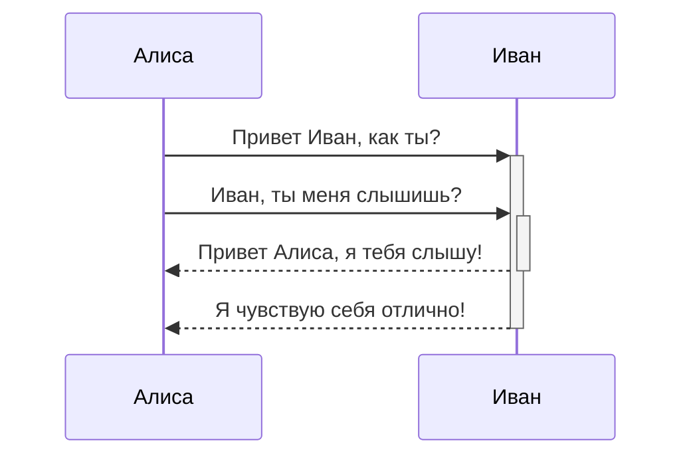

С приложением [Obsidian](https://obsidian.md/) наверняка знакомы все, кто пишет тексты. В сочетании с установленным набором плагинов Obsidian закрывает 80% рабочих потребностей аналитика. В статье приведен обзор лишь малой части возможностей, которые пригодятся при документировании проекта.

# Встроенные возможности

## Исключаем дублирование информации в документации

Если один и тот же текст необходимо указывать в нескольких различных разделах документации - ее будет сложно поддерживать в актуальном состоянии в случае изменений. В Obsidian для решения этой задачи можно использовать различные подходы:

- вынести текст в отдельную статью и использовать ссылки на нее при упоминании в других статьях. Ссылку на статью добавить очень просто - через двойные квадратные скобки, вот так `[[название_статьи]]`. Причем можно сослаться как на саму статью, так и на любой раздел `[[название_статьи#заголовок]]`, или абзац внутри нее `[[название_статьи#^абзац]]`

- если ссылки не достаточно и нужно продублировать текст в другой статье - делаем так - `![[название_статьи#^абзац]]`. При этом изменения, вносимые в текст, будут применены везде - и в статье-источнике, и в статье, в которой текст продублирован.

## Вставляем диаграммы и схемы

Для вставки диаграмм и схем в документацию Obsidian также предлагает несколько решений. Можно вставить файл-изображение диаграммы, а можно сгенерировать прямо в документе, воспользовавшись одной из текстовых нотаций - [Mermaid](https://mermaid.js.org/intro/) или [PlantUML](https://plantuml.com/ru/). Причем для отрисовки диаграмм в нотации Mermaid не нужно дополнительно устанавливать плагины, достаточно в текст вставить, например такой фрагмент:

````

````
и диаграмма появится в вашей статье, вот в таком виде


## Готовим документацию для публикации

И опять эту задачу можно решить в Obsidian несколькими способами. Первый, самый простой, сгенерировать документацию в PDF-файл. Второй, более интересный - сгенерировать из файлов документации статический сайт и разместить его на сервере. Obsidian сам по себе не выполняет генерацию статических сайтов, но он предоставляет удобный функционал для подготовки статей для генерации в формате HTML. Этот функционал называется шаблоны.

Дело в том, что все генераторы статических сайтов- предполагают наличие определенной мета-информации  в каждой статье документации, например, дата ее публикации, краткое описание статьи или признак, является статья черновиком или должна быть опубликована. У каждого инструмента-генератора сайта состав мета-информации различен. Obsidian позволяет создать один или несколько шаблонов с нужным набором мета-информации и затем вставлять их в статьи для публикации в один клик.  
# Плагины

- [BPMN] - плагин, разработанный на основе bpmn-js. Содержит весь необходимый функционал, в том числе и Token Simulation. Достаточно создать новый файл с расширением *.bpmn* и можно начинать строить модель бизнес-процесса. Чтобы отобразить модель в другой статье, достаточно в нужном месте вставить код:
````
```bpmn
url: [[my-diagram.bpmn]]
```
````

Так мы облегчим себе задачу поддержания документации в актуальном состоянии. Если необходимо внести изменения в модель - нужно это сделать только один раз - в bpmn-файле модели. Во всех статьях, ссылающихся на модель будет отображаться ее актуальная версия

- [Excalidraw] - часто простая схема или диаграмма в документе нарисованная "на коленке" бывает информативнее и нагляднее нескольких страниц текста. Данный плагин позволяет легко создавать такие изображения в вставлять их в статьи. Вот простой пример

  

![[план внедрения.png]]

Большой набор бесплатных примитивов и объектов позволяет создавать изображения любой сложности.
# Другие инструменты для работы с Obsidian

- [Quartz 4](https://quartz.jzhao.xyz/) - генератор статических сайтов из *Markdown*-текстов. Адаптирован для работы с текстами, написанными в Obsidian. Главная отличительная особенность - простая публикация текстов на сайте (расположенном, например на Github) с симпатичным интерфейсом, похожим на Obsidian